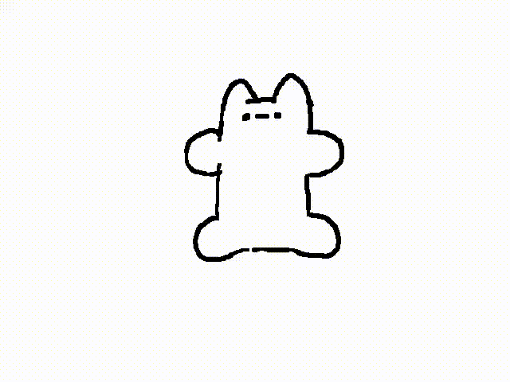

# Hsteresis.github.io
<!DOCTYPE html>
<html lang="en">
<head>
    <meta charset="UTF-8">
    <meta name="viewport" content="width=device-width, initial-scale=1.0">
    <title>神秘小网站</title>
</head>
<body>
    <h1 align="center">个人介绍</h1>
    
生日：2007-02-14 作者：xxx

    

    
<b>爱好一：</b>画画

    
<b>爱好二：</b>看动漫

    
<b>爱好三：</b>玩游戏

    

    
<b>你这一生也不会忘记我</b>

   
<video src="girl.mp4" controls  style="width:80%;max-width:800px;margin-top:20px;" title="忘怀"></video>

</body>
</html>
/*^*/
